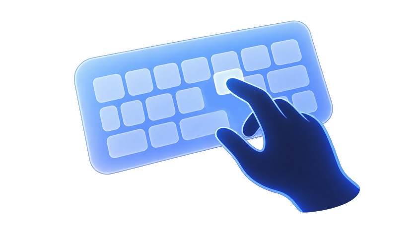
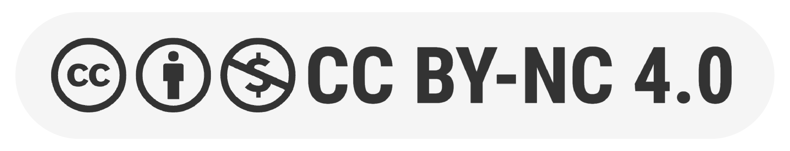

  <h1 align="center"> ProKey</h1>
  

    <a href="https://zion-ziyang.github.io/">Ziyang&nbsp;Zhang</a>
    ·
   Zhenyu&nbsp;Li
    ·
    Gan&nbsp;Huang
     
    <a href="https://www.xun-qian.com/">Xun&nbsp;Qian</a>
    ·
    <a href="http://www.cad.zju.edu.cn/home/gfzhang/">Guofeng&nbsp;Zhang*</a>
  

  

     
  

<h2 align="center">ICXR 2026</h2>

  

    This is the accompanying repository to the paper "Understanding and Supporting Bare-Hand Typing While Walking in Mixed Reality". For any questions, please feel free to contact the first author.
  

  

  <h2 align="center">Study System</h2>
    

      You can access the <a href="System/">study system</a> used in the paper.
    

  

  

  <h2 align="center">License</h2>
    <h3 align="center"></h3>
  

